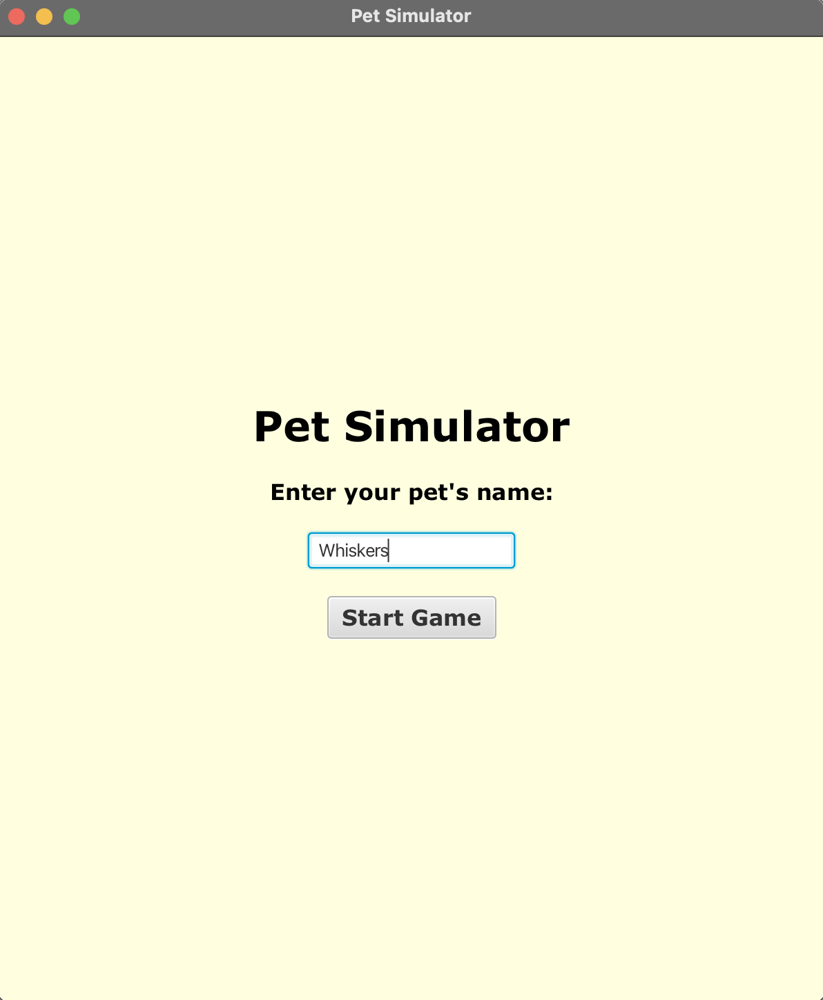
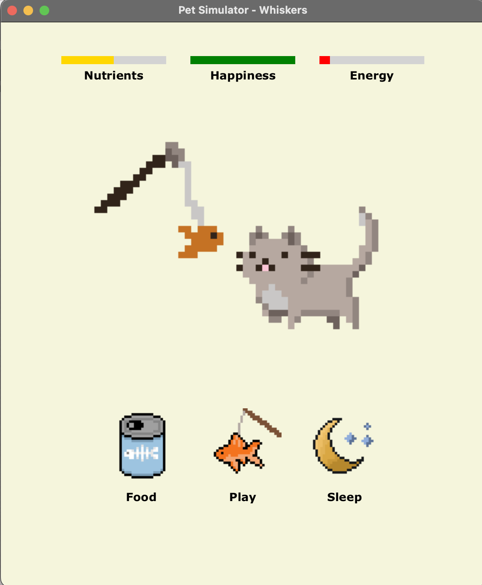
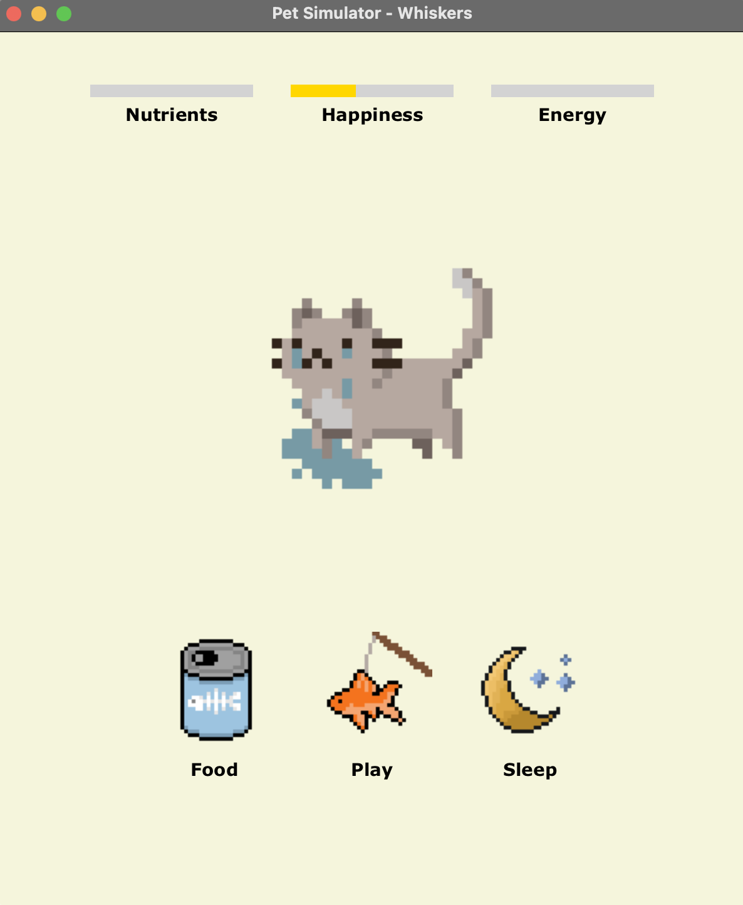

# Pet Simulator

A JavaFX-based virtual pet care game featuring custom pixel art animations and dynamic stat management. Care for your virtual pet by feeding, playing, and ensuring they get enough sleep!

## Features

- **Custom Pixel Art**: Hand-drawn sprites with multiple animations (feeding, playing, sleeping, crying)
- **Dynamic Stat System**: Real-time health bars that change color based on pet wellness
- **Interactive Animations**: Unique animations for each action with proper timing and sequencing
- **Automatic Stat Decay**: Background timer gradually decreases stats for ongoing challenge
- **Emotional Feedback**: Pet cries when neglected and shows happiness when cared for
- **Home Screen**: Pet naming system and clean scene management
- **Animation State Management**: Prevents overlapping animations and handles user input properly

## Screenshots

### Home Screen


### Main Gameplay


### Pet Emotional States


## Technologies Used

- **Java** - Core programming language
- **JavaFX** - GUI framework and animation system
- **Piskel** - Pixel art creation and sprite sheet management

## How to Run

1. Clone this repository
```bash
git clone https://github.com/SuperDoo14/project.git
```
2. Ensure you have JavaFX SDK installed and configured
3. Open the project in your IDE (IntelliJ IDEA recommended)
4. Run `Main.java`
5. Enter your pet's name on the home screen
6. Start caring for your virtual companion!

## Game Mechanics

- **Nutrients**: Increase by feeding, decrease through play and time
- **Happiness**: Increase through play and feeding, decrease over time  
- **Energy**: Increase through sleep, decrease through play and time
- **Stat Bars**: Change color from green (healthy) to yellow (warning) to red (critical)
- **Crying Animation**: Triggers when any stat reaches zero, stops when pet is cared for

## What I Learned

Building this project taught me valuable programming concepts:

- **Advanced JavaFX**: Complex animation systems, scene management, and custom UI components
- **State Management**: Handling multiple animation states and preventing conflicts
- **Event-Driven Programming**: Responsive button handling and timeline coordination  
- **Game Development**: Implementing game loops, stat systems, and user feedback
- **Object-Oriented Design**: Clean class structure with proper encapsulation
- **Problem Solving**: Debugging animation conflicts and timing issues

## Development Journey

I built this project to expand my understanding of, and demonstrate, Java programming skills and game development concepts. It evolved from a simple button-clicking interface to a fully animated, emotionally engaging pet care experience.

The biggest technical challenges included:
- Managing overlapping animations and user input
- Creating smooth transitions between different pet states
- Implementing proper timing for background stat decay
- Ensuring the crying system felt responsive but not frustrating

## Future Enhancements

Potential improvements could include:
- Sound effects and background music
- Multiple pet types with different behaviors
- Save/load functionality for persistent pet care
- Achievement system and pet growth mechanics
